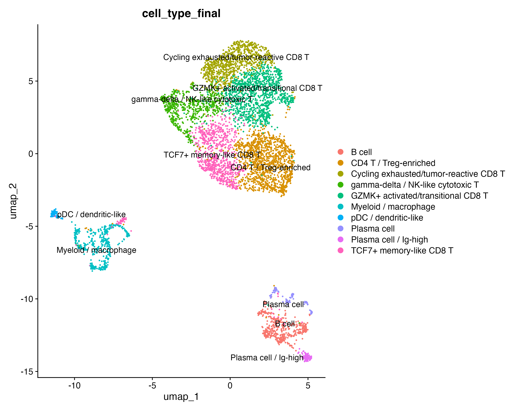
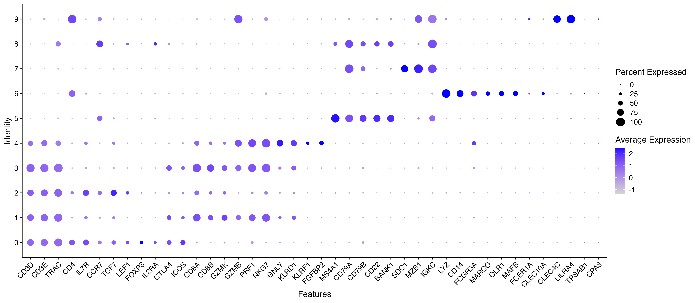
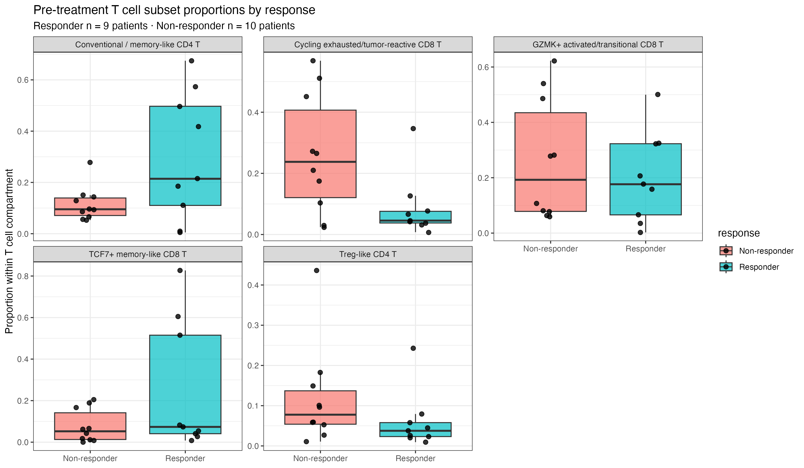
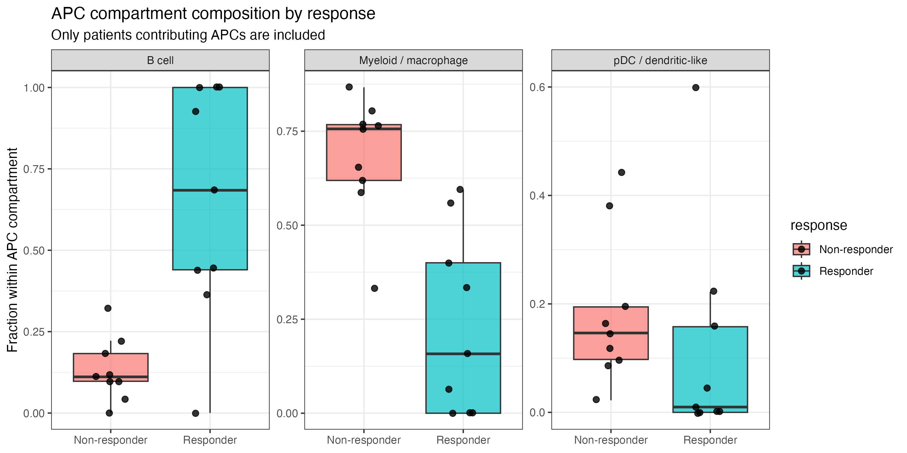
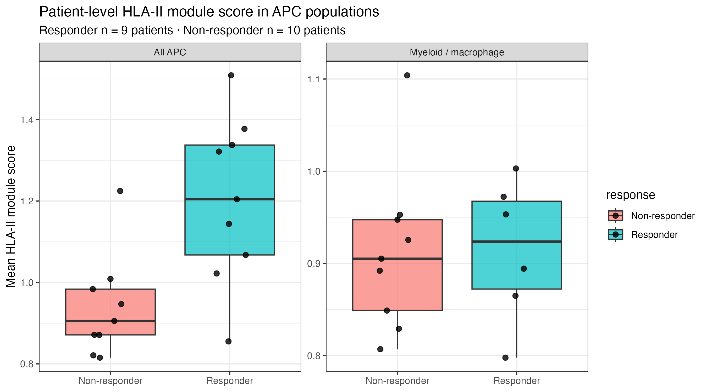
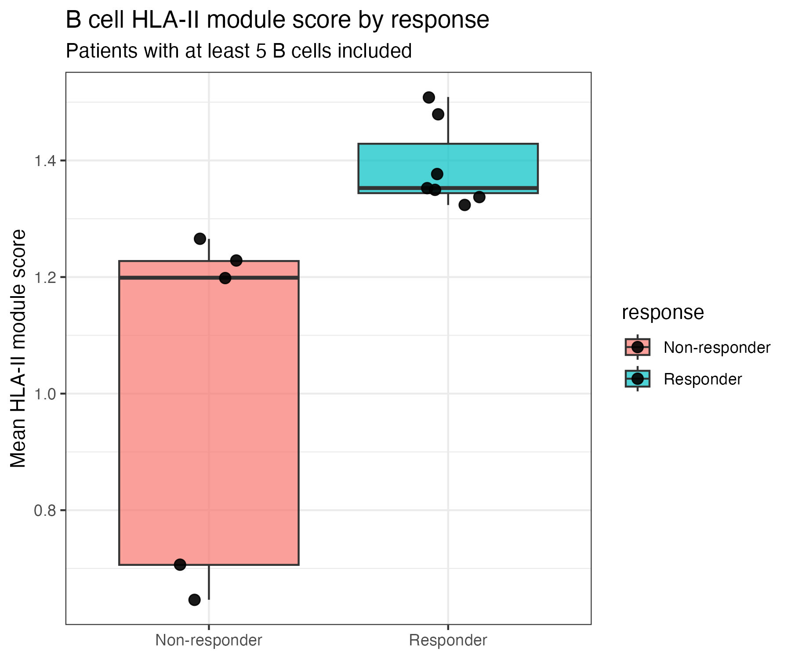

# Immune cell states and HLA class II expression in melanoma response to checkpoint immunotherapy

> Reanalysis of pre-treatment single-cell RNA-seq from 19 melanoma patients (GSE120575) asking whether tumour-infiltrating immune cell composition and HLA class II expression differ between responders and non-responders to immune checkpoint blockade.
>
> > **Main result:** When cell-type proportions were calculated relative to all immune cells, no difference remained significant after correction for multiple comparisons. Within the antigen-presenting-cell compartment, however, responders were B-cell-enriched, whereas non-responders were myeloid/macrophage-enriched.
>
> To address this compositional difference, HLA class II module scores were tested within individual APC subtypes. B-cell HLA class II expression was higher in responders (BH-adjusted p = 0.0115; 12/19 patients evaluable), supported at the individual-gene level by HLA-DRA, CD74, and HLA-DPA1.
>
> This was a biologically motivated, exploratory patient-level follow-up analysis. The small and unevenly represented B-cell subset means that composition and expression cannot be fully separated, and the result should not be interpreted as a validated biomarker.
---

## Background

Immune checkpoint inhibitors can produce durable responses in a subset of melanoma patients, while many patients do not benefit. Identifying features of the pre-treatment tumour immune microenvironment that associate with response remains an important translational question.

## Question

In pre-treatment melanoma biopsies, do tumour-infiltrating immune cell composition and HLA class II expression differ between patients who subsequently respond to checkpoint immunotherapy and those who do not?

The analysis was designed around T-cell subsets. The strongest signal, however, emerged in the B-cell/APC compartment, which was not anticipated.

---

## Dataset

**GSE120575** — Sade-Feldman M, et al. *Cell* 2018;175(4):998–1013.e20.

| Feature | Value |
|---|---:|
| Cells analysed | 5,928 |
| Patients | 19 |
| Responders | 9 |
| Non-responders | 10 |
| Responder cells | 2,725 |
| Non-responder cells | 3,203 |
| Genes retained | 36,590 |
| Platform | Smart-seq2 |
| Input data | TPM |
| Cells analysed here | Pre-treatment CD45+ immune cells |

Only pre-treatment cells were analysed. This asks whether responders and non-responders differ before therapy, rather than mixing baseline differences with treatment-induced changes.

---

## Analysis workflow

The analysis was performed in R using Seurat.

| Script | Purpose |
|---|---|
| `01_data_import.R` | Metadata cleaning, safe expression-matrix reading, pre-treatment cell selection and sparse matrix construction |
| `02_melanoma_analysis.R` | QC, normalisation, PCA/UMAP, clustering, marker-based annotation, T-cell refinement, patient-level proportions, APC composition, HLA class II scoring and validation checks |

---

## Quality control and preprocessing

Quality control metrics were inspected before downstream analysis.

| Metric | Median | Range |
|---|---:|---:|
| nFeature_RNA | 2,042 | 1,093–7,922 |
| percent.mt | 1.10% | 0.22–3.67% |

No aggressive filtering was applied. Mitochondrial percentage was uniformly low, and gene detection was consistent with full-length Smart-seq2 data.

`nCount_RNA` was inspected but not used for filtering because the supplied data were TPM values. TPM values are already library-size normalised and do not represent true sequencing depth.

`LogNormalize` was applied for consistency with standard Seurat workflows. Because TPM values are already library-size normalised, this step primarily performs log transformation.

PCA was performed on 2,000 variable features. Clustering used 20 principal components and resolution 0.4, yielding 10 clusters. UMAP was used for visualisation.

---

## Cell type annotation

Annotation was marker-based. Each cluster was checked against expected marker panels rather than labelled from a single marker.





| Cluster | Label | Main basis |
|---:|---|---|
| 0 | CD4 T / Treg-enriched | CD4, IL7R, partial FOXP3 |
| 1 | GZMK+ activated/transitional CD8 T | CD8A/B, GZMK, CRTAM |
| 2 | TCF7+ memory-like CD8 T | CD8A/B, TCF7, CCR7, IL7R; exhaustion low |
| 3 | Cycling exhausted/tumour-reactive CD8 T | PDCD1, TOX, LAG3, HAVCR2, TIGIT, ENTPD1, CXCL13, TNFRSF9 |
| 4 | gamma-delta / NK-like cytotoxic T | CD3D/E, TRAC, TRDC, TRGC1/2, KLRD1, GNLY |
| 5 | B cell | MS4A1, CD22, BANK1 |
| 6 | Myeloid / macrophage | MARCO, OLR1, CD300E, MAFB, LYZ |
| 7, 8 | Plasma cell | SDC1, immunoglobulin genes |
| 9 | pDC / dendritic-like | CLEC4C |

### Annotation checks

**Melanoma contamination.** MLANA, PMEL and TYR were low across clusters, consistent with CD45+ immune-cell sorting. MITF signal in cluster 6 was checked against myeloid and melanocytic markers. Because cluster 6 showed strong myeloid/macrophage markers and lacked other melanocytic markers, it was annotated as myeloid/macrophage rather than melanoma contamination.

**Cluster 0 was not treated as pure Treg.** FOXP3 was detected in 29.3% of cluster 0 cells. Subclustering separated a Treg-like CD4 T population from conventional/memory-like CD4 T cells.

| Subcluster | n cells | FOXP3 | CTLA4 | ICOS | IL7R | Interpretation |
|---|---:|---:|---:|---:|---:|---|
| 0_1 | 353 | 53.3% | 75.4% | 70.5% | 49.0% | Treg-like CD4 T |
| 0_0 | 568 | 21.8% | 40.7% | 40.7% | 69.0% | Conventional/memory-like CD4 T |
| 0_2 | 347 | 17.3% | 36.6% | 50.7% | 70.3% | Conventional/memory-like CD4 T |

**Cluster 4 was not treated as pure NK.** It expressed T-cell markers (CD3D, CD3E, TRAC) together with TRDC/TRGC and cytotoxic markers, so it was labelled gamma-delta / NK-like cytotoxic T.

---

## Results

### 1. Cell type proportions

Cell type proportions were computed per patient and compared between responders and non-responders using Wilcoxon rank-sum tests with Benjamini-Hochberg correction.

Because proportions are compositional, the primary analysis was performed at two levels: across all immune cells and within the T-cell compartment.

When cell-type proportions were calculated relative to all immune cells, no difference remained significant after BH correction. A separate follow-up analysis of composition within the antigen-presenting-cell compartment is reported below; it uses a different denominator and represents a separate family of comparisons.



Directional trends were biologically consistent but did not survive correction.

| Cell type | Median responder | Median non-responder | BH-adjusted p |
|---|---:|---:|---:|
| pDC / dendritic-like | 0.006 | 0.018 | 0.120 |
| B cell | 0.094 | 0.014 | 0.151 |
| Myeloid / macrophage | 0.009 | 0.102 | 0.165 |
| Cycling exhausted/tumour-reactive CD8 T | 0.042 | 0.169 | 0.165 |
| Treg-like CD4 T | 0.030 | 0.068 | 0.188 |
| Conventional/memory-like CD4 T | 0.210 | 0.079 | 0.255 |
| TCF7+ memory-like CD8 T | 0.061 | 0.033 | 0.296 |

Responders showed higher median B-cell, conventional/memory-like CD4 T and TCF7+ memory-like CD8 T proportions. Non-responders showed higher median myeloid/macrophage, cycling exhausted/tumour-reactive CD8 T and Treg-like CD4 T proportions.

These trends were consistent with the original study directionally, but they were not statistically significant after multiple-testing correction in this patient-level reanalysis.

---

### 2. APC composition

Because the dataset contained CD45-positive immune cells and HLA class II is classically associated with professional antigen-presenting cells, APC composition was examined separately. This APC-focused analysis was a biologically motivated follow-up rather than a pre-specified primary analysis and should therefore be interpreted as hypothesis-generating.

APCs included B cell, Myeloid/macrophage, and pDC / dendritic-like.



APC composition differed between response groups.

| APC type | Median responder | Median non-responder | BH-adjusted p |
|---|---:|---:|---:|
| B cell | 0.684 | 0.111 | 0.00790 |
| Myeloid / macrophage | 0.158 | 0.756 | 0.00502 |
| pDC / dendritic-like | 0.0098 | 0.146 | 0.110 |

Responders had a B-cell-enriched APC compartment, whereas non-responders had a myeloid/macrophage-enriched APC compartment.

---

### 3. HLA class II module score

An HLA class II module score was calculated using HLA-DRA, HLA-DRB1, HLA-DPA1, HLA-DPB1 and CD74. The score was averaged per patient within antigen-presenting cells.



Across all APCs, HLA class II module score was higher in responders (BH-adjusted p = 0.021).

Because APC composition differed between groups, the analysis was repeated within each APC subtype.

| APC subtype | n responders | n non-responders | Median responder | Median non-responder | BH-adjusted p |
|---|---:|---:|---:|---:|---:|
| B cell | 7 | 5 | 1.35 | 1.20 | 0.0115 |
| Myeloid / macrophage | 3 | 8 | 0.953 | 0.899 | 0.475 |
| pDC / dendritic-like | 0 | 6 | NA | 0.846 | not testable |

The difference persisted within B cells. No evidence of a difference was detected within myeloid/macrophage cells (3 responders and 8 non-responders evaluable; BH-adjusted p = 0.475). Because the responder subgroup was small, this comparison was underpowered and should not be interpreted as evidence that no myeloid difference exists. pDC/dendritic-like cells could not be tested because responder-side data were insufficient.

---

### 4. B-cell HLA class II signal

Within B cells, the HLA-II module score was higher in responders (BH-adjusted p = 0.0115).



Among patients contributing at least 5 B cells, responder and non-responder patient-level B-cell HLA-II scores did not overlap:

- Lowest responder B-cell HLA-II score: 1.32
- Highest non-responder B-cell HLA-II score: 1.27

However, this analysis included only 12 of 19 patients.

B-cell inclusion was uneven between groups:

- Responders included: 7/9
- Non-responders included: 5/10

Non-responders were disproportionately excluded because of low B-cell numbers.

---

### 5. Validation of the B-cell HLA-II finding

The B-cell HLA-II module score is a derived metric, so individual HLA class II genes were also tested at patient level.

| Gene | Median responder | Median non-responder | BH-adjusted p |
|---|---:|---:|---:|
| HLA-DRA | 2.40 | 2.08 | 0.0144 |
| CD74 | 2.54 | 2.39 | 0.0144 |
| HLA-DPA1 | 2.25 | 1.84 | 0.0383 |
| HLA-DPB1 | 2.11 | 1.73 | 0.130 |
| HLA-DRB1 | 2.07 | 1.84 | 0.516 |

HLA-DRA, CD74, and HLA-DPA1 were individually higher in responders after BH correction across the five tested genes. HLA-DPB1 and HLA-DRB1 were not statistically significant but showed the same directional trend.

B-cell HLA-II score correlated with B-cell count across all evaluable patients (Spearman rho = 0.73, p = 0.007). Within-group correlations were weaker (rho = 0.15 in non-responders and rho = 0.39 in responders), which is consistent with a substantial between-group component. However, the small within-group sample sizes and uneven B-cell availability mean that abundance-related confounding cannot be excluded.

Restricting the analysis to B cells and testing individual genes increased the specificity of the observation, but did not completely separate expression from composition. Together, these checks support the B-cell HLA-II result as an exploratory patient-level signal rather than a validated biomarker.

---

## Comparison with the original study

Sade-Feldman et al. reported that the balance between TCF7+ memory-like and dysfunctional/exhausted CD8 T cells distinguished responders from non-responders.

In this reanalysis, the same directional trend was observed: responders had higher median TCF7+ memory-like CD8 T proportions, while non-responders had higher median cycling exhausted/tumour-reactive CD8 T proportions. However, these differences did not remain significant after BH correction at the patient level.

The strongest corrected signal in this reanalysis emerged instead in the B-cell/APC compartment.

---

## Limitations

- The analysis included 19 patients, which limits statistical power.
- The HLA-II analysis within B cells included only 12 of 19 patients.
- Non-responders were disproportionately excluded from the analysis within B cells because of low B-cell numbers.
- Cell type proportions are compositional; formal compositional analysis was not performed in this first phase.
- Data were supplied as TPM rather than raw counts, limiting count-based differential expression approaches.
- CD45+ sorting means malignant cells were not represented, so tumour-intrinsic HLA class II expression could not be assessed.
- Annotation was marker-based rather than reference-mapped.
- Differential expression was not performed; the primary analysis is compositional and conducted at the patient level.
- The APC-focused analysis and the follow-up analysis within B cells were biologically motivated rather than pre-specified confirmatory tests.
- The myeloid/macrophage subtype comparison included only three evaluable responders and was therefore underpowered.

---

## Next steps

- If raw count data can be obtained, perform patient-level pseudobulk differential expression within B cells to identify which antigen-presentation genes contribute to the observed signal.
- With the existing TPM matrix, perform sensitivity analyses using alternative patient-level summaries and B-cell inclusion thresholds, without applying count-based differential-expression models.
- Validation in an independent melanoma single-cell cohort, ideally including malignant cells to assess tumour-intrinsic HLA class II expression.
- Formal compositional analysis, such as centred log-ratio transformation, rather than raw proportions.
- Reference-based annotation to reduce dependence on manual marker interpretation.

---

## Repository structure

```text
melanoma_scRNA/
├── README.md
├── sessionInfo.txt
├── .gitignore
├── scripts/
│   ├── 01_data_import.R
│   └── 02_melanoma_analysis.R
├── figures/
└── results/
```

Raw data and processed Seurat objects are not included in the repository.

The raw data can be downloaded from GEO accession GSE120575 and placed in `data_raw/`.

---

## Reproducibility

Scripts should be run in numerical order. R and package versions are recorded in `sessionInfo.txt`.

Large raw data files and processed R objects are excluded from the repository via `.gitignore`.

---

## Reference

Sade-Feldman M, Yizhak K, Bjorgaard SL, et al. Defining T cell states associated with response to checkpoint immunotherapy in melanoma. *Cell.* 2018;175(4):998–1013.e20.

## Technical notes and future directions

Detailed supplementary notes are available in [`docs/`](docs/):

- [Methodological notes](docs/methodological_notes.md): data type constraints, unit of replication, and validation strategy for the B-cell HLA class II signal.
- [Spatial/TLS future directions](docs/spatial_tls_future_directions.md): why spatial or histological validation is required before making any tertiary lymphoid structure claim.
- [Multi-omics tumour-intrinsic future directions](docs/multiomics_tumour_intrinsic_future_directions.md): how the exploratory immune-cell signal could be integrated with tumour-intrinsic features in future matched cohorts.
- [Tumour–immune validation framework](docs/tumour_immune_validation_framework.md): conceptual experimental and spatial follow-up strategies for the exploratory melanoma immune-cell findings.

These documents describe validation strategies and future directions. No analysis beyond the main repository has been performed.
## Additional workflow demonstrations

- [Melanoma spatial transcriptomics demo](extensions/melanoma_spatial_transcriptomics_demo/): an introductory Seurat workflow using an independent public human melanoma spatial transcriptomics dataset. This is a technical workflow demonstration and not a spatial validation of the GSE120575 responder/non-responder analysis.
